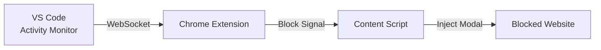

# 🎯 Focus Mode Extensions

**Stay focused while coding. Block distracting websites automatically when VS Code is active.**

<p align="center">
  
</p>

## 🚀 Quick Start

### Prerequisites

- VS Code 1.80.0+
- Google Chrome (or Chromium-based browser)

### Installation

#### Step 1: Install VS Code Extension

[](marketplace-link)

```bash
# Or via command line
code --install-extension your-publisher.focus-mode-vscode
```

#### Step 2: Install Chrome Extension

[](chrome-store-link)

Or manually: [Download latest release](github-releases)

#### Step 3: Configure

1. Open VS Code → Verify "Focus Mode: Connected" in status bar
2. Open Chrome → Click extension icon → Add sites to block
3. Start coding! Sites are blocked automatically ⚡

## 🔧 How It Works



1. **VS Code Extension** monitors your coding activity (file edits, focus)
2. **WebSocket Server** broadcasts status on `localhost:9876`
3. **Chrome Extension** receives real-time updates
4. **Content Script** injects modal overlay on blocked sites

## ⚙️ Configuration

### VS Code Settings

```json
{
  "focusMode.port": 9876,
  "focusMode.autoStart": true,
  "focusMode.idleTimeout": 30
}
```

### Chrome Settings

- Add sites via popup: `youtube.com`, `*.reddit.com`
- Supports wildcard patterns
- Stored locally (no cloud sync)

## 🐛 Troubleshooting

**Chrome showing "Not Connected"?**

1. Check VS Code extension is installed and active
2. Verify port 9876 is not blocked by firewall
3. Run: `Focus Mode: Show Status` in VS Code
4. Restart both extensions

**Modal not appearing?**

- Ensure site is added to block list
- Check you're actively coding (30s timeout)
- Inspect console for errors

[Full troubleshooting guide →](docs/troubleshooting.md)

## 🔒 Privacy

- ✅ **100% Local** - No external servers
- ✅ **No Tracking** - Zero analytics
- ✅ **Open Source** - [View code](https://github.com/...)

## 📊 System Requirements

| Component | Requirement           |
| --------- | --------------------- |
| VS Code   | 1.80.0+               |
| Chrome    | 116+ (Manifest V3)    |
| OS        | Windows, macOS, Linux |
| Network   | Localhost only        |

## 🤝 Contributing

See [CONTRIBUTING.md](CONTRIBUTING.md)

## 📝 License

MIT © [Your Name](LICENSE)

---

**Star ⭐ this repo if it helps you stay focused!**
