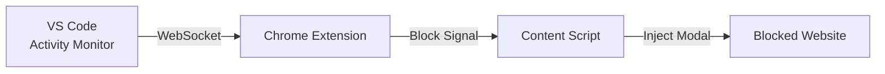

# 🎯 Focus Fortress

**Stay focused while coding. Block distracting websites automatically when VS Code is active.**

## 🚀 Quick Start

### Prerequisites

- VS Code 1.70.0+
- Google Chrome (or Chromium-based browser) 116+

### Installation

#### Step 1: Install VS Code Extension

[](https://marketplace.visualstudio.com/items?itemName=RohitKhatri.vscode-focus-bridge)

```bash
# Or via command line
code --install-extension RohitKhatri.vscode-focus-bridge
```

#### Step 2: Install Chrome Extension

### Build from Source

Download the latest release from [GitHub Releases](https://github.com/khatri-rohit/focus-fortress.git) and load it as an unpacked extension in Chrome.

Or build it yourself:

```bash
cd chrome-focus-blocker
npm install
npm run build:chrome
# Load dist/ as unpacked extension in Chrome
```

and load dist/chrome as an unpacked extension in Chrome. (supported for chrome, edge and brave).

and if using Firefox, load dist/firefox as an unpacked extension in Firefox.

#### Step 3: Configure

1. Open VS Code → Verify "Focus Fortress: running (9876)" in status bar
2. Open Chrome → Click extension icon → Add sites to block
3. Start coding! Sites are blocked automatically ⚡

## 🔧 How It Works



1. **VS Code Extension** monitors your coding activity (file edits, selections, window focus)
2. **WebSocket Server** broadcasts status on `localhost:9876`
3. **Chrome Extension** receives real-time updates
4. **Content Script** injects modal overlay on blocked sites

## ⚙️ Configuration

### VS Code Settings

```json
{
  "focusFortress.port": 9876,
  "focusFortress.heartbeatIntervalSec": 10,
  "focusFortress.inactivityTimeoutSec": 120,
  "focusFortress.secretToken": "",
  "focusFortress.autoStart": true
}
```

### Chrome Extension

- Add sites via popup: `youtube.com`, `*.reddit.com`
- Supports wildcard patterns (subdomains)
- Stored locally (no cloud sync)

## 🐛 Troubleshooting

**Chrome showing "Disconnected"?**

1. Check VS Code extension is installed and active
2. Verify port 9876 is not blocked by firewall
3. Run: `Focus Fortress: Show status` in VS Code
4. Restart both extensions

**Modal not appearing?**

- Ensure site is added to block list
- Check you're actively coding (120s inactivity timeout)
- Inspect console for errors

**Extension not working?**

- Ensure both extensions are installed and enabled
- Check VS Code status bar for server status
- Try restarting VS Code and Chrome

[Report Troubleshooting](https://thisisrohit.dev/contact)

## 🔒 Privacy

- ✅ **100% Local** - No external servers or data transmission
- ✅ **No Tracking** - Zero analytics or telemetry
- ✅ **Open Source** - [View code](https://github.com/RohitKhatri/focus-fortress)

## 📊 System Requirements

| Component | Requirement           |
| --------- | --------------------- |
| VS Code   | 1.70.0+               |
| Chrome    | 116+ (Manifest V3)    |
| OS        | Windows, macOS, Linux |
| Network   | Localhost only        |

## 🤝 Contributing

Don't hesitate to [open an issue](https://github.com/khatri-rohit/focus-fortress/issues/new) or [submit a pull request](https://github.com/khatri-rohit/focus-fortress/pulls) if you have any suggestions or improvements.

## 📝 License

MIT © [Rohit Khatri](https://github.com/khatri-rohit)

---

**Star ⭐ this repo if it helps you stay focused!**
